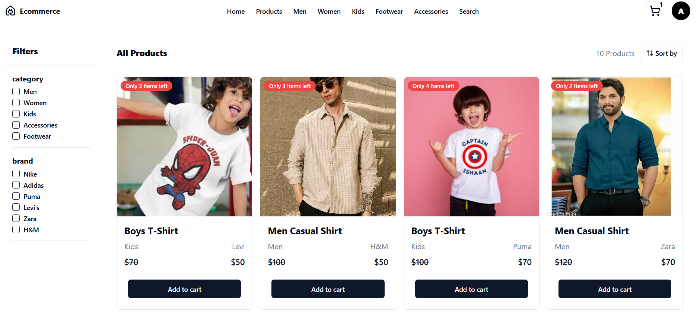
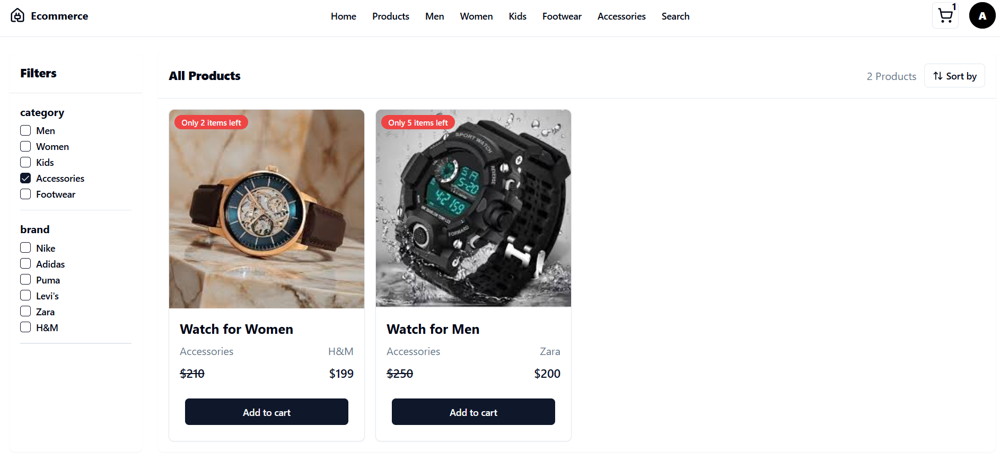
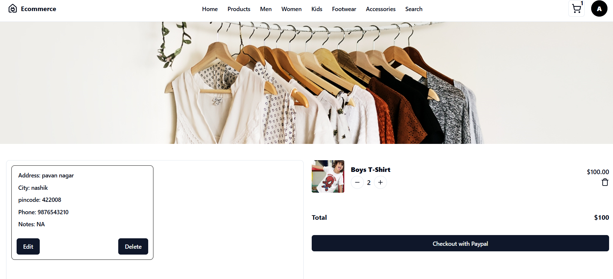
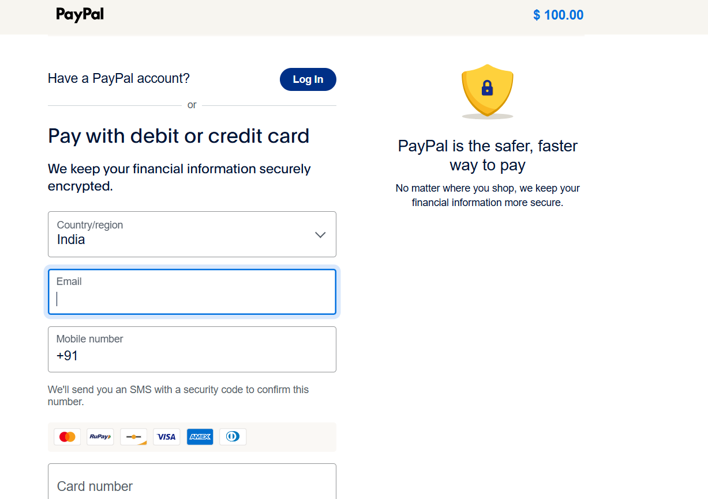

# 🛒 Ecommerce App

A modern and responsive **Ecommerce Web Application** that provides a seamless online shopping experience. Users can browse products, search items, manage their shopping cart, and securely place orders through an intuitive interface.

## 🚀 Tech Stack

<p align="center">


</p>

---

## ✨ Features

- 🔐 User Authentication (Login & Signup)
- 🏠 Responsive Home Page
- 📦 Browse Products
- 🔍 Search & Filter Products
- 📄 Product Details
- 🛒 Shopping Cart
- ❤️ Wishlist Support
- 💳 Checkout Process
- 📱 Mobile Responsive UI
- ⚡ Fast and Smooth User Experience

---

## 📂 Project Structure

```text
Ecommerce_App/
│
├── screenshots/
│   ├── Login.png
│   ├── SignUp.png
│   ├── Home.png
│   ├── Products.png
│   ├── Filter.png
│   ├── Cart.png
│   └── Payments.png
│
├── client/
│   ├── public/
│   ├── src/
│   ├── vite.config.js
│   └── package.json
│
├── server/
│   ├── controllers/
│   ├── middleware/
│   ├── models/
│   ├── routes/
│   ├── uploads/
│   ├── server.js
│   └── package.json
│
└── README.md
```

---

## ⚙️ Installation

### 1. Clone the repository

```bash
git clone https://github.com/ajinkya029/Ecommerce_App.git
cd Ecommerce_App
```
### 2. Install Frontend Dependencies

```bash
cd client

npm install

npm run dev
```

Frontend runs on:

```
http://localhost:5173

```

### 3. Install Backend Dependencies

```bash
cd ../server

npm install

npm run dev
```

Backend runs on:

```
http://localhost:5000
```

---

## 🔑 Environment Variables

Create a `.env` file inside the **server** directory.

```env
PORT=5000

MONGO_URI=your_mongodb_connection_string

JWT_SECRET=your_jwt_secret

CLIENT_URL=http://localhost:3000

CLOUDINARY_CLOUD_NAME=your_cloud_name
CLOUDINARY_API_KEY=your_cloudinary_api_key
CLOUDINARY_API_SECRET=your_cloudinary_api_secret

PAYPAL_MODE=sandbox
PAYPAL_CLIENT_ID=your_paypal_client_id
PAYPAL_CLIENT_SECRET=your_paypal_client_secret
```

Create a `.env` file inside the **server** directory.

```env
VITE_API_URL=http://localhost:5000/api
```

---

## 📸 Screenshots

### 🏠 Login Page


---

### 🏠 Sign Up Page


---

### 🏠 Home Page


---

### 🏠 Product Page



---

### 🏠 Filter Page



---

### 🏠 Cart Page



---

### 🏠 Payment Page



---

## 🚀 Future Enhancements

- 💳 Payment Gateway Integration
- 📦 Order Tracking
- ⭐ Product Reviews & Ratings
- 🛠️ Admin Dashboard
- 📊 Inventory Management
- 🎁 Coupon & Discount System
- 📧 Email Notifications
- 🌙 Dark Mode

---

## 🤝 Contributing

Contributions are welcome!

1. Fork the repository.
2. Create your feature branch.

```bash
git checkout -b feature/FeatureName
```

3. Commit your changes.

```bash
git commit -m "Add new feature"
```

4. Push to the branch.

```bash
git push origin feature/FeatureName
```

5. Open a Pull Request.

---

## 🐛 Issues

If you find a bug or have a feature request, feel free to open an issue.

---

## 📄 License

This project is licensed under the **MIT License**.

---

## 👨‍💻 Author

**Ajinkya**

- GitHub: https://github.com/ajinkya029

---

## ⭐ Show Your Support

If you found this project helpful, please consider giving it a ⭐ on GitHub. It helps others discover the project and motivates further development!
